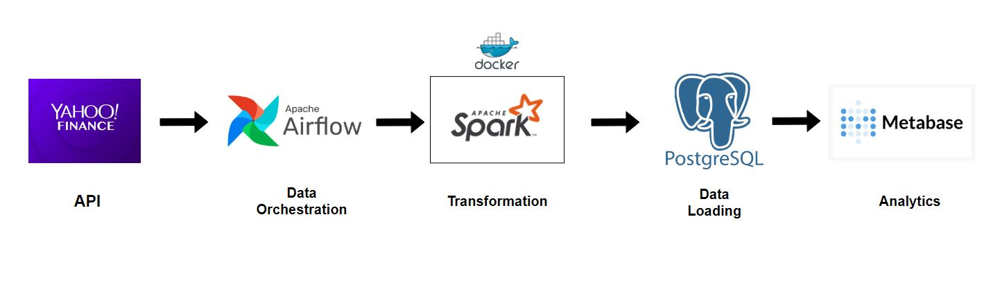

# Stock Market Data pipeline using Airflow, Spark, Postgres and Metabase

What is this pipeline exactly doing?

1. Extracting data from Yahoo finance API.
2. Storing the raw data into an Minio bucket using Airflow.
3. Transforming the data for Analytics using PySpark (which runs seperately on the docker container).
4. Load the transformed data into Postgres for analytics.
5. Using Metabase as a service through Docker for analytics.

## Architecture

1. **Yahoo API**: Source of the stock data.
2. **Apache Airflow**: Orchestrates the ETL process and manages task distribution. For this Airflow congifurations i am using Astronomer to setup my Airflow.
3. **Spark**: Transforming all the data fetched from the API.
4. **Postgres**: Storing all the transformed data from the spark job.
5. **Metabase**: Analytics platform for the data stored after the transformation.

## System Setup
1. Clone the repository.
   ```bash
    https://github.com/Swapppyy/Stock_market_data_pipeline.git
   ```
2. Install Astro CLI on your system and enter:
   ```bash
    astro dev init
    astro dev start
   ```
3. Build the image for the Spark's Dockerfile
   ```bash
    docker build -t airflow/stock-app .
   ```
4. Test the dag 
   ```bash
    astro dev run dags test stock_market "any old date"
   ```
5. Login into Airflow, Minio, Postgres and Metabase
   ```bash
    http://localhost:3000/
    http://localhost:8080/
    http://localhost:9001/
    http://localhost:5432/
   ```

